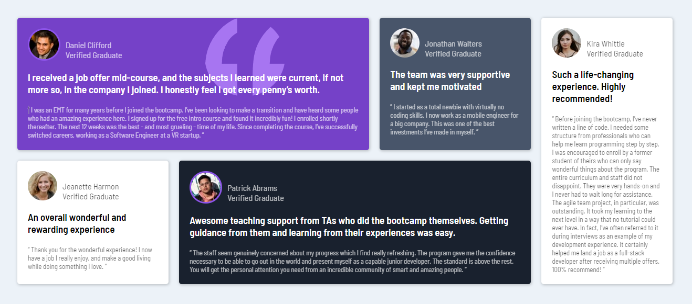

 

# Frontend Mentor - Testimonials grid section solution

This is a solution to the [Testimonials grid section challenge on Frontend Mentor](https://www.frontendmentor.io/challenges/testimonials-grid-section-Nnw6J7Un7). Frontend Mentor challenges help you improve your coding skills by building realistic projects.

## Table of contents

- [Overview](#overview)
  - [The challenge](#the-challenge)
  - [Screenshot](#screenshot)
- [My process](#my-process)
  - [Built with](#built-with)
  - [What I learned](#what-i-learned)
  - [Useful resources](#useful-resources)
- [Author](#author)

## Overview

### The challenge 🔥

🎯 Users should be able to:

- View the optimal layout for the site depending on their device's screen size

### Screenshot

## My process

### Built with ⚒️

- Semantic HTML5 markup
- CSS
- Flexbox
- Mobile-first workflow

### What I learned 🧠

🚀 The main objective of this project was to build a “complex” layout using only CSS Flexbox, even though the challenge was to do it using CSS Grid

😍 But with this project I also learned a bit and put responsive design into practice

### Useful resources

- [Flexbox Docs](https://developer.mozilla.org/pt-BR/docs/Learn/CSS/CSS_layout/Flexbox) - This was my main source of knowledge for building this project

## Author

- [@Guizzs26](https://github.com/Guizzs26)

Made with ❤️ by Guilherme, 👋🏽 get in touch !

<h4> 
🚧  🚀 This project is finished 🚀 🚧
</h4>

